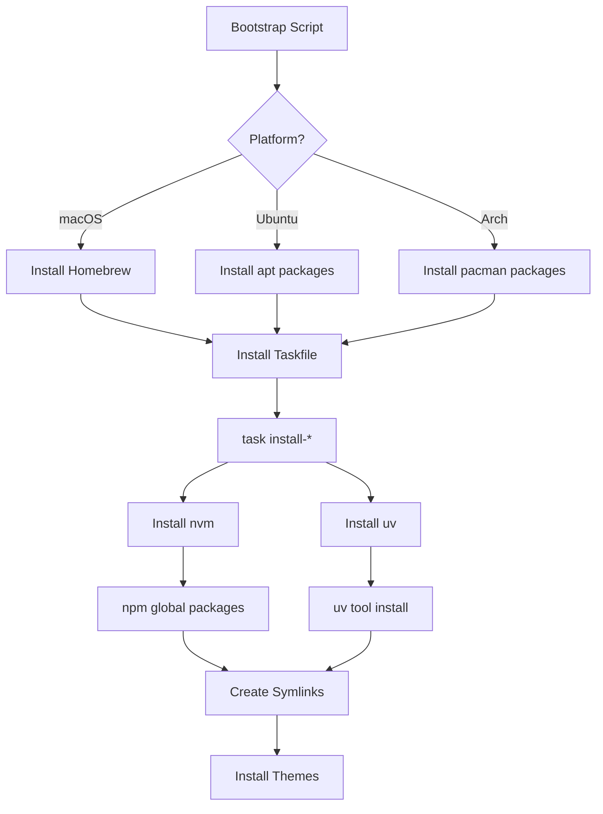

# Architecture Overview

Understanding how the dotfiles repository is organized and why design decisions were made.

## Design Philosophy

The dotfiles follow three core principles:

1. **DRY (Don't Repeat Yourself)** - Shared configurations in `common/`, platform-specific overrides only
2. **Cross-platform Consistency** - Same tools, same workflows across macOS, Ubuntu, and Arch
3. **Intelligent Automation** - Taskfile handles complexity, symlinks handle deployment

## Directory Structure

```text
dotfiles/
├── common/                 # Shared configurations (all platforms)
│   ├── .config/
│   │   ├── zsh/           # Shell configuration
│   │   ├── tmux/          # Terminal multiplexer
│   │   ├── nvim/          # Neovim editor
│   │   ├── yazi/          # File manager
│   │   └── ...
│   └── .shell/            # Shell utilities (aliases, functions)
│
├── macos/                  # macOS-specific overrides
│   ├── .config/           # macOS-only configs
│   ├── .gitconfig         # Git with VS Code, OSX keychain
│   ├── .profile           # macOS PATH setup
│   └── .local/bin/        # macOS-specific scripts
│
├── wsl/                    # WSL Ubuntu-specific overrides
│   ├── .config/           # WSL-only configs
│   ├── .gitconfig         # Git with Neovim, wincred
│   └── .shell/            # WSL-specific shell setup
│
├── arch/                   # Arch Linux-specific overrides (future)
│
├── taskfiles/              # Task automation (130+ tasks)
│   ├── brew.yml           # Homebrew tasks (macOS)
│   ├── nvm.yml            # Node.js management
│   ├── uv.yml             # Python management
│   ├── wsl.yml            # WSL-specific tasks
│   ├── arch.yml           # Arch-specific tasks
│   └── themes.yml         # Theme management
│
├── scripts/
│   ├── install/           # Bootstrap scripts
│   └── utils/             # Utility scripts (tools, theme-sync)
│
├── Brewfile                # macOS packages
├── Taskfile.yml            # Main task orchestration
└── symlinks                # Symlink deployment manager
```

## How Symlinks Work

The symlink system uses a **layered approach**: shared base + platform-specific overlay.

### Step 1: Link Common Files

```bash
./symlinks link common
```

Links files from `common/` to `$HOME`:

```text
common/.config/zsh/.zshrc  →  ~/.config/zsh/.zshrc
common/.config/tmux/tmux.conf  →  ~/.config/tmux/tmux.conf
common/.config/nvim/  →  ~/.config/nvim/
```

### Step 2: Overlay Platform-Specific Files

```bash
./symlinks link macos  # or wsl, arch
```

Overlays platform-specific files, overriding common ones when they exist:

```text
macos/.gitconfig  →  ~/.gitconfig  (overrides common)
macos/.profile  →  ~/.profile
macos/.local/bin/*  →  ~/.local/bin/*
```

### Intelligent Conflict Resolution

The symlink manager handles conflicts intelligently:

- **File exists in both**: Platform version takes precedence
- **File only in common**: Common version is used
- **File only in platform**: Platform version is added

This allows:

- Shared Neovim config in `common/`
- Platform-specific Git configs in `macos/` or `wsl/`
- Common shell aliases with platform-specific additions

## Package Management Strategy

Different layers use different package managers for their strengths:

### System Package Managers

For system utilities and compiled tools:

- **macOS**: Homebrew (`brew`)
- **Ubuntu/WSL**: apt
- **Arch Linux**: pacman + yay (AUR)

**Examples**: bat, eza, fd, ripgrep, fzf, tmux, neovim

### Language Version Managers

For runtime consistency across platforms:

- **Python**: uv (replaces pyenv, virtualenv)
- **Node.js**: nvm
- **Rust**: cargo (for some tools on Ubuntu)

**Why**: Version managers provide:

- Cross-platform consistency
- Easy version switching
- Project-specific versions (`.python-version`, `.nvmrc`)
- No system-level conflicts

### Package Installation Flow



## Platform Detection

Platform detection happens at multiple levels:

### 1. Shell Detection (.zshrc)

```bash
if [[ "$OSTYPE" == "darwin"* ]]; then
    # macOS-specific
elif [[ -f /proc/version ]] && grep -q Microsoft /proc/version; then
    # WSL-specific
elif [[ -f /etc/arch-release ]]; then
    # Arch-specific
fi
```

### 2. Taskfile Detection

```yaml
vars:
  PLATFORM:
    sh: |
      if [ "$(uname)" = "Darwin" ]; then
        echo "macos"
      elif [ -f /etc/arch-release ]; then
        echo "arch"
      else
        echo "linux"
      fi
```

### 3. Application-Level Detection

Neovim, tmux, and other apps use environment variables or conditionals:

```lua
-- Neovim init.lua
if vim.loop.os_uname().sysname == "Darwin" then
    -- macOS-specific plugins
end
```

## Configuration Layers

Configurations follow an inheritance model:

### Example: Git Configuration

**Common** (if it existed):

```gitconfig
[user]
    name = Chris
    email = chris@example.com
```

**macOS Override**:

```gitconfig
[core]
    editor = code --wait
[credential]
    helper = osxkeychain
```

**WSL Override**:

```gitconfig
[core]
    editor = nvim
[credential]
    helper = /mnt/c/Program\\ Files/Git/mingw64/bin/git-credential-wincred.exe
```

### Example: Neovim Configuration

**Common** (`common/.config/nvim/`):

- Base LSP setup
- Core plugins (telescope, treesitter)
- Keybindings
- Colorscheme manager

**Platform-Specific** (optional):

- AI plugins (CodeCompanion, Copilot) - macOS only
- Platform-specific LSP configurations
- Environment-dependent settings

## Why This Architecture?

### Advantages

**1. Minimal Duplication**

Only platform differences exist in platform directories. Shared configs live in `common/`, edited once.

**2. Clear Separation of Concerns**

- `common/` - What works everywhere
- `macos/`, `wsl/`, `arch/` - Platform quirks only
- `taskfiles/` - Automation logic
- `scripts/` - Deployment and utilities

**3. Easy Maintenance**

- Update shared config → all platforms benefit
- Add platform-specific feature → edit platform directory only
- No complex merge logic

**4. Testable**

Each platform can be tested independently:

```bash
# Test macOS installation
task install-macos

# Test WSL installation
task install-wsl
```

### Trade-offs

**Symlink Complexity**

The two-layer symlink system adds some complexity compared to a flat structure. However:

- Managed by `./symlinks` script
- One-command deployment (`./symlinks relink macos`)
- Clear error messages

**Platform-Specific Knowledge Required**

You need to know which directory to edit:

- Shared feature → `common/`
- Platform feature → `macos/`, `wsl/`, etc.

Documentation and experience make this clear over time.

## Key Design Decisions

### 1. Why Not Stow?

GNU Stow is popular but has limitations:

- Complex directory structure requirements
- Less flexible conflict resolution
- Harder to understand for newcomers
- Our custom symlink manager:
  - Handles two-layer linking
  - Clear error messages
  - Platform-aware
  - Better for our use case

### 2. Why Taskfile Over Makefile?

**Taskfile advantages**:

- Cross-platform (Makefile varies)
- Better syntax for complex commands
- Built-in dependency management
- Modular includes (taskfiles/*.yml)
- Self-documenting (`task --list`)

### 3. Why Version Managers for Languages?

**uv and nvm** provide:

- **Consistency**: Same Node/Python versions across platforms
- **Isolation**: Project-specific versions
- **No conflicts**: System Python vs development Python
- **Easy updates**: `nvm install --lts`, `uv python install 3.12`

Homebrew/apt/pacman are great for system tools, not language runtimes.

### 4. Why Separate Theme Systems?

**Ghostty** (600+ themes) and **tinty** (Base16 themes) run in parallel:

- Ghostty has live preview, extensive theme library
- tinty synchronizes tmux, bat, fzf, shell
- Not all Ghostty themes are Base16-compatible
- Parallel systems provide flexibility

## Evolution of Architecture

The architecture evolved through six phases:

1. **Phase 1**: Package management cleanup (uv, nvm)
2. **Phase 2**: Tool registry and documentation
3. **Phase 3**: Taskfile automation (130+ tasks)
4. **Phase 4**: Theme synchronization (tinty)
5. **Phase 5**: Tool discovery (`tools` command)
6. **Phase 6**: Cross-platform expansion (VM testing)

Each phase built on previous work, refining the architecture iteratively.

## Next Steps

Now that you understand the architecture:

- **Package Management Details**: [Package Management](package-management.md)
- **Tool Discovery System**: [Tool Discovery](tool-discovery.md)
- **Theme System**: [Themes](themes.md)
- **Development History**: [Project Phases](../development/phases.md)

---

**Questions?** → [Troubleshooting](../reference/troubleshooting.md)
