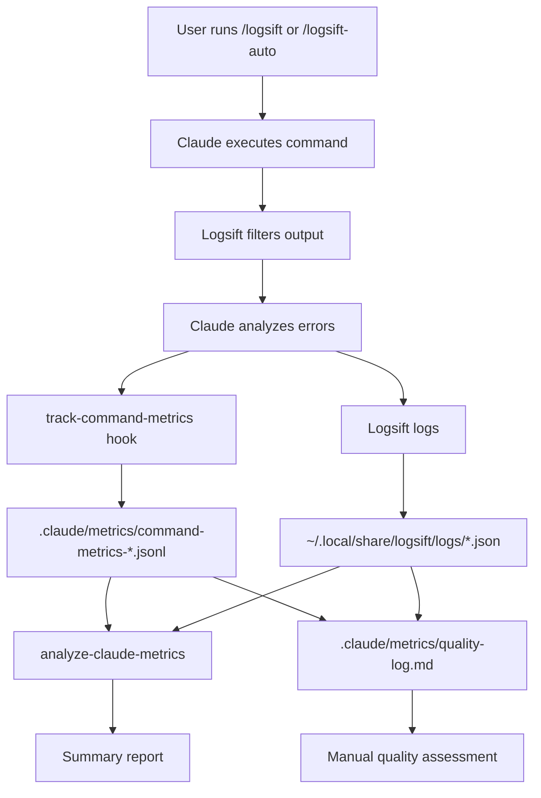

# Metrics Tracking Architecture

Technical documentation for the logsift command metrics and quality tracking system.

!!! info "User Guide"
    For usage instructions, see [Working with Claude Code](../claude-code/working-with-claude.md#metrics-quality-tracking)

## Overview

The metrics tracking system provides quantitative and qualitative assessment of logsift command effectiveness, enabling data-driven optimization of Claude Code workflows.

### Design Goals

1. **Zero-friction collection**: Metrics gathered automatically without user intervention
2. **Actionable insights**: Data structured for comparative analysis
3. **Quality over quantity**: Track correctness and methodology, not just token counts
4. **Lightweight**: Minimal performance impact, fail-safe operation

### Components



## Data Model

### Automated Metrics

**File**: `.claude/metrics/command-metrics-YYYY-MM-DD.jsonl`

**Format**: JSON Lines (one JSON object per line)

```json
{
  "timestamp": "2025-12-03T15:30:45.123456",
  "session_id": "abc123def456",
  "command": "/logsift",
  "full_command": "/logsift \"bash test.sh\" 15",
  "cwd": "/Users/chris/dotfiles",
  "type": "logsift"
}
```

**Schema**:

- `timestamp` (ISO 8601): When command was invoked
- `session_id` (string): Claude Code session identifier
- `command` (string): Slash command used (`/logsift` or `/logsift-auto`)
- `full_command` (string): Complete command with arguments
- `cwd` (string): Working directory
- `type` (string): Command type for filtering

**Why JSONL?**

- Append-only (no need to parse entire file)
- One command = one line = atomic operation
- Easy to process with `jq`, `grep`, streaming parsers
- Resilient to corruption (only last line at risk)

### Logsift Analysis Data

**File**: `~/.local/share/logsift/logs/session-*.json`

**Generated by**: Logsift itself

```json
{
  "command": "bash test-install.sh",
  "duration": "12m 34s",
  "exit_code": 1,
  "analysis": {
    "error_count": 5,
    "warning_count": 3,
    "errors": [
      {"line": 142, "message": "Package 'foo' not found"},
      {"line": 256, "message": "Connection refused"}
    ],
    "warnings": [
      {"line": 89, "message": "Deprecated flag --old-style"}
    ]
  }
}
```

**Usage**: Referenced by `analyze-claude-metrics` for error/warning counts

### Manual Quality Log

**File**: `.claude/metrics/quality-log.md`

**Format**: Markdown with structured entries

```markdown
## YYYY-MM-DD HH:MM - Session ID

**Command**: `/logsift "command"`

**Context**: Brief description

**Quantitative**:
- Initial errors: X
- Final errors: 0
- Iterations: Y
- Tokens: Z (from /cost)

**Qualitative**:
- Correctness: ✅/⚠️/❌
- Efficiency: ✅/⚠️/❌
- Methodology: ✅/⚠️/❌

**Notes**:
- Observations
- What worked well
- What could improve

**Comparison** (if applicable):
- /logsift vs /logsift-auto differences
```

**Purpose**: Capture qualitative assessments that can't be automated

## Implementation

### Hook: track-command-metrics

**File**: `.claude/hooks/track-command-metrics`

**Language**: Python 3

**Trigger**: PostToolUse or Stop hook (TBD - currently manual invocation)

**Logic**:

1. Read hook input from stdin (JSON)
2. Extract session_id, transcript_path, cwd
3. Parse transcript to find last slash command
4. Filter for /logsift commands
5. Create metric entry with timestamp
6. Append to daily JSONL file

**Error handling**: Never blocks - all exceptions caught and logged to stderr

**Configuration**: None required (uses git repo root + `.claude/metrics/`)

### Analysis Script: analyze-claude-metrics

**File**: `apps/common/analyze-claude-metrics`

**Language**: Bash + jq

**Dependencies**:

- `jq` - JSON parsing
- `bc` - Floating point arithmetic
- Standard Unix tools (find, grep, tail, wc)

**Features**:

- Summary mode: Count commands by type, show recent usage
- Details mode: Per-session breakdown with errors/warnings
- Date filtering: Analyze specific time periods
- Logsift integration: Read error counts from logsift logs

**Usage**:

```bash
analyze-claude-metrics              # Summary
analyze-claude-metrics --details    # Detailed
analyze-claude-metrics --date 2025-12-03  # Specific date
```

**Output sections**:

1. Command Usage: Counts by type
2. Recent Commands: Last 10 invocations
3. Error Resolution Analysis: From logsift logs
4. Recommendations: Next steps

## Key Performance Indicators

### Quality Metrics (Manual Assessment)

**Success Rate**:

```text
Success Rate = (Successful Sessions / Total Sessions) * 100
```

Where "successful" = all errors resolved, tests passing

**Root Cause Accuracy**:

```text
RCA Accuracy = (Correct Root Cause Identifications / Total Sessions with Related Errors) * 100
```

Requires manual assessment: Did Claude correctly identify the root cause?

**Methodology Compliance**:

```text
Compliance = (Sessions Following 5-Phase Approach / Total Sessions) * 100
```

Check quality log for:

- Did Claude wait for full analysis?
- Did Claude determine error relationships?
- Did Claude read files before editing?
- Did Claude iterate properly?

### Efficiency Metrics (Semi-Automated)

**Average Iterations**:

```text
Avg Iterations = Sum(Iterations per Session) / Total Sessions
```

Track in quality log: How many logsift runs until success?

**Token Usage per Error**:

```text
Tokens per Error = Total Tokens / Total Errors Resolved
```

Requires `/cost` data + error counts from logsift

**Context Efficiency**:

```text
Context Saved = (Original Output Lines - Logsift Filtered Lines) / Original Output Lines * 100
```

Typical: 95-98% reduction (10,000 lines → 200 lines)

### Comparative Metrics

**Success Delta**:

```text
Delta = (Success Rate of /logsift-auto) - (Success Rate of /logsift)
```

Positive = /logsift-auto more successful
Negative = /logsift more successful

**Token Delta**:

```text
Delta = Avg Tokens(/logsift-auto) - Avg Tokens(/logsift)
```

Hypothesis: /logsift-auto uses slightly more tokens for command interpretation

**Parsing Accuracy** (/logsift-auto only):

```text
Parsing Accuracy = (Correctly Parsed Commands / Total /logsift-auto Invocations) * 100
```

Manual assessment: Did Claude run the right command?

## Data Retention

### Automated Logs

**Command metrics**: `.claude/metrics/command-metrics-*.jsonl`

- Retention: Indefinite (lightweight, ~1KB per day)
- Rotation: New file per day
- Archive: Move to `.claude/metrics/archive/YYYY/` annually

**Logsift logs**: `~/.local/share/logsift/logs/*.json`

- Retention: Managed by logsift
- Typically: Last 100 sessions
- Purge: `logsift clean --older-than 30d`

### Manual Logs

**Quality log**: `.claude/metrics/quality-log.md`

- Retention: Indefinite
- Growth: ~200 bytes per entry
- Archive: Split annually to `quality-log-YYYY.md` if >100 entries

## Privacy & Security

**What's tracked**:

- Command invocations and types
- Timestamps and session IDs
- Working directories
- Error/warning counts

**What's NOT tracked**:

- Actual command output or errors (those are in logsift logs)
- File contents or code changes
- API keys or credentials
- Personal identifiable information

**Data location**:

- All data stored locally in dotfiles repo
- No external transmission
- Included in `.gitignore` if contains sensitive paths

**OpenTelemetry export** (optional):

- Controlled by environment variables
- Requires explicit enablement
- Sends to configured OTEL endpoint only

## Future Enhancements

### Automated Quality Detection

Parse transcripts to detect methodology compliance:

```python
# Pseudo-code
def check_methodology(transcript):
    checks = {
        "waited_for_analysis": search_for("logsift analysis complete"),
        "determined_relationships": search_for("related|independent"),
        "read_before_edit": check_tool_sequence(["Read", "Edit"]),
        "iterated": count_logsift_invocations() > 1
    }
    return ComplianceScore(checks)
```

### Cost Tracking Integration

Integrate with Anthropic Admin API:

```bash
# Fetch usage for specific session
curl -H "x-api-key: $ADMIN_API_KEY" \
  https://api.anthropic.com/v1/organizations/usage_report/messages \
  | jq '.message_usage[] | select(.session_id == "abc123")'
```

Requires: Admin API key (organization admins only)

### Comparison Dashboard

Generate visual comparison report:

```markdown
# Weekly Report: 2025-12-01 to 2025-12-07

## Usage
| Command | Invocations | Avg Duration |
|---------|------------|--------------|
| /logsift | 15 | 8m 32s |
| /logsift-auto | 8 | 9m 15s |

## Success Rate
- /logsift: 87% (13/15)
- /logsift-auto: 75% (6/8)

## Token Efficiency
- /logsift: 38k avg tokens
- /logsift-auto: 42k avg tokens (+10%)

## Recommendation
Continue using /logsift for known commands.
Use /logsift-auto for exploratory testing.
```

### Pre-commit Agent Metrics

Extend to track commit workflows:

```json
{
  "timestamp": "2025-12-03T16:00:00",
  "type": "commit-agent",
  "pre_commit_hooks": ["shellcheck", "markdownlint", "prettier"],
  "iterations": 2,
  "initial_errors": 5,
  "final_errors": 0,
  "tokens_used": 12000
}
```

Track:

- Pre-commit iterations (how many fix-and-retry cycles)
- Hook failures by type
- Token savings from logsift filtering hook output
- Commit message quality scores

## Testing

### Unit Tests (Future)

```bash
# Test metric collection
python -m pytest .claude/hooks/test_track_command_metrics.py

# Test analysis script
bash tests/test_analyze_logsift_metrics.sh
```

### Integration Tests

```bash
# Simulate command invocation
echo '{"session_id": "test123", "cwd": "/tmp", "command": "/logsift"}' | \
  .claude/hooks/track-command-metrics

# Verify file created
test -f .claude/metrics/command-metrics-$(date +%Y-%m-%d).jsonl

# Verify content
jq . < .claude/metrics/command-metrics-$(date +%Y-%m-%d).jsonl
```

## References

### External

- [Langfuse Token Tracking](https://langfuse.com/docs/observability/features/token-and-cost-tracking) - LLM cost tracking patterns
- [Datadog LLM Observability](https://www.datadoghq.com/product/llm-observability/) - Production monitoring
- [Sentry KPIs](https://blog.sentry.io/core-kpis-llm-performance-how-to-track-metrics/) - Core performance indicators
- [Claude Code Monitoring](https://code.claude.com/docs/en/monitoring-usage.md) - Official usage tracking

### Internal

- [Working with Claude Code](../claude-code/working-with-claude.md) - User guide
- [Structured Logging](./structured-logging.md) - Log format standards
- [Shell Libraries](./shell-libraries.md) - Logging implementations
- [Hooks Reference](../reference/tools/hooks.md) - Available hooks

## Changelog

### 2025-12-03 - Initial Implementation

- Created `track-command-metrics` hook
- Implemented `analyze-claude-metrics` script
- Defined JSONL schema for command metrics
- Created quality log template
- Documented KPIs and analysis methodology
